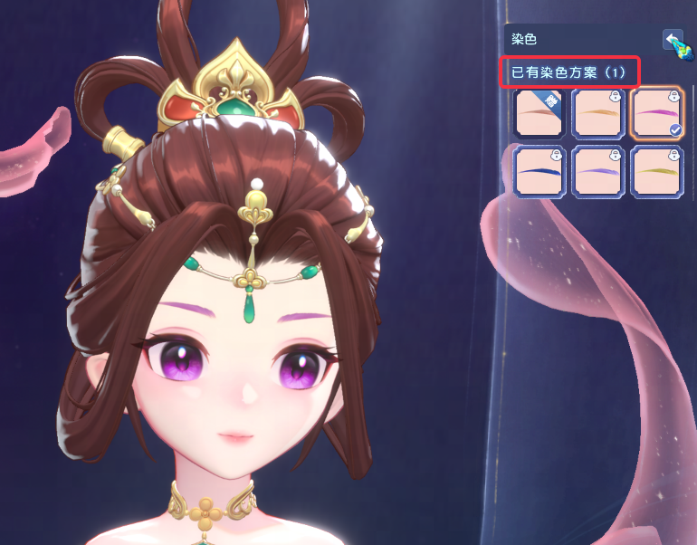

独特的染色Gameplay（用染色shader对贴图染色而非给shader传参数）

- 一般的染色， 都是 Tint(color， tint_color) x PBR, 染色做材质里面

- 但是这样有以下问题

  - 指令数--HSV染色就会有100个指令
  - 耦合--只要有东西忘记处理，就会出问题，并且逻辑上比较复杂，每个材质都有自己的染色逻辑，客户端代码也不容易组织。

- 梦幻西游采取二段

  染色

  - 染色shader作用在base/emissive**贴图**上， 贴图动态被染色然后回传材质。

    所有的材质染色逻辑统一，客户端代码也是高度统一的。

  - 这样**材质复杂度和染色复杂度**无关--染色shader可以做的很复杂

- 二段染色需要注意的

  - 上面已经写了，所有会影响最终表现颜色的，最好**和基础颜色贴图, 自发光贴图挂钩**

  - 如果最终有个颜色叠加上去又不挂钩， 最终就没法染出好的结果，

    譬如颜色公式是 PBR(base_map) + fresnel, 这样怎么染色fresnel都叠了奇怪的颜色上去

比较重要的是，梦幻西游的特效采用的Shell材质，只有少部分特殊实现（比如妆容的特效）是Unreal的Cascade转换为Messiah的Particle。因此特效也是在整个染色逻辑中的一部分，高度统一。

染色玩法框架和工具稳定之后，新出的材质的染色完全不需要程序介入，美术TA策划自己玩就好了。参考

[染色编辑器.md](../工具/染色编辑器.md)

玩法中还有如图的染色部位高光表现和UI对应的染色。

由于染色的组合数非常多，也就意味着如果是UI出资源的话会导致美术累死，因此如果UI需要染色对应的表现，也是用shader实现，但是由于角色的染色shader比较复杂，UI的染色逻辑经过了简化，看起来差不多就行。

简化后的UI的染色shader大致的实现可以在shadertoy上进行预览

https://www.shadertoy.com/view/lX2XzV