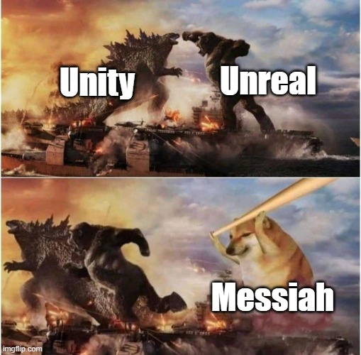
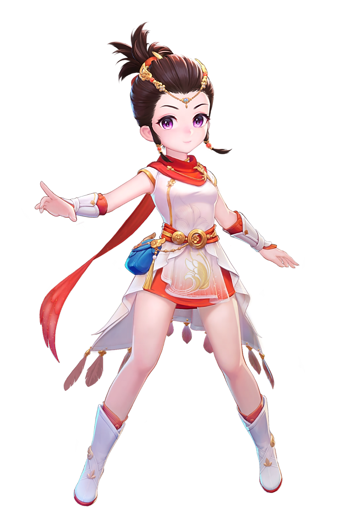
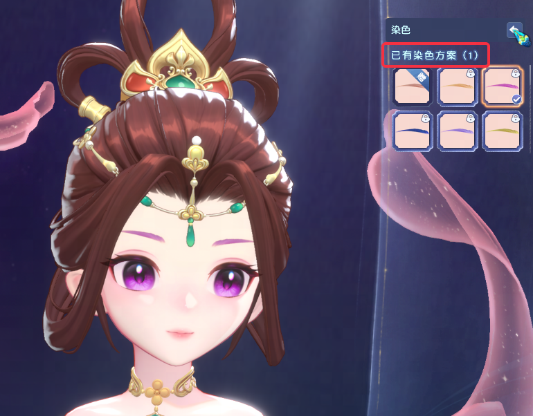

# 由于项目保密原因，不会出现内部编辑器、工具等图像，只有部分外放内容。

[TOC]

> 注意动态图像gif或者直接上传github的mp4比较大，直接web预览可能需要一些加载时间 。还请耐心等待。

一听到梦幻西游端游，可能会觉得是技术栈过早的项目，确实如此，作为20年前的2D游戏，采用CPU软光栅渲染的自研引擎（[云风](https://blog.codingnow.com/)开发的风魂引擎）, 确实已经落后时代了。

为了提升画面表现力（卖时装），我负责的模块Runtime采用独立的自研3D引擎（Messiah）

1、**3D引擎作为一个独立进程，同时为多个2D进程（玩家本地会多开几个游戏同时玩）提供渲染服务，两个引擎通过共享内存进行通信，通过SwapChain让3D引擎在2D引擎窗口绘制**

2、为了解决3D自研引擎编辑器不完善的问题，引擎组开发此前花了数年时间研发了**Unreal<->Messiah**对齐的一系列工具链，**美术，TA，策划乃至程序在开发中编辑器用都采用的Unreal4.26**，而放弃使用自研引擎Messiah的编辑器。

整个玩法是我经历了从**0-1**的过程

职责上：我负责了

* **搭建这套繁杂的跨引擎游戏制作管线**
* **工具链的完善，跨引擎的数据组织形式**

* **Runtime Gameplay的绝大部分开发任务**

而引擎组的同学主要负责对齐引擎的渲染效果，资产转换等。

整体渲染还原二次元偏厚涂的风格立绘画风。上图是立绘效果，下图是Messiah引擎Runtime渲染效果

      
      

如果对角色渲染比较感兴趣，可以看这一个文档，不过这块主要是TA的工作内容：[角色渲染.md](角色渲染.md )

## 1.Unreal对齐Messiah

Unreal和Messiah一系列对齐的技术链，首先来看下实机效果

**以下视频均为UE&Messiah双引擎同时打开 + 实机录制的同步镜头视频**

这个是UE、Messiah通过RPC，双开两个引擎实时同步，对齐Camera等

## 2.Gamplay

### 2.0 脚本代码框架

#### 2.0.1 异步逻辑协程

#### 2.0.2 逻辑Plugin化

#### 2.0.3 SubSystem

#### 2.0.4 网络同步模块

### 2.1 动画系统

#### 2.1.0 Unreal制作简易的动画蓝图，Messiah中实现完整的Graph(类似动画蓝图)

#### 2.1.1 ik的应用，其中还有输出OpenPose数据生成AI图像的玩法（专利）

https://github.com/user-attachments/assets/0a64261e-dc78-4378-aaec-a1401b09f6fa

#### 2.1.2 Messiah骨骼拼接技术，挂接物动画同步

#### 2.1.3 软骨以及布料

### 2.2 换装

首先请看简短的演示

https://github.com/user-attachments/assets/4c67dbc9-e85d-4945-aae4-50b62a6d0e19

类似叠纸的奇迹暖暖的换装

### 2.3 妆容

https://github.com/user-attachments/assets/f0781c08-47ce-4814-85bc-7182229a6223

### 2.4 染色

独特的染色Gameplay（用染色shader对贴图染色而非给shader传参数）)

玩法中还有如图的染色部位高光表现和UI对应的染色。

UI需要染色对应的图标

简化后的UI的染色shader大致的实现可以在shadertoy上进行预览

https://www.shadertoy.com/view/lX2XzV

### 2.5 场景以及LOD

## 3.Unreal开发

### 3.1 面向美术扩展编辑器

#### 3.1.1 染色编辑器等

#### 3.1.2 自动LOD工具链

减面：

* Vertex Color
* Houdini

合图:

* PCA(主成分分析)

#### 3.1.3 Sequencer

剧情（Cinematic）编辑在本项目的工作流程中是一个业务难点。

说到过美术是采用**Unreal**作为编辑器，那自然和其他的普通的UE项目是一样的，采用Sequencer编辑LevelSequence，需要把uasset转换为自研引擎**Messiah**能够识别的格式。

单独开发了插件去做数据转换，依托网易自研引擎无关的剧情系统Montage。

每套时装美术都会出一个CG宣传PV，有一些会变成Runtime的过场动画资产

比如如下视频:

CG:【爱如龙卷风，超唯美新春外观甜蜜来袭】 https://www.bilibili.com/video/BV1n5411C7Wi

Runtime:

https://github.com/user-attachments/assets/49e2b03e-7dc7-4e91-b3bc-8d6dbbf8f35d

### 3.2 面向策划工具

#### 3.2.1 蓝图转换为自研引擎数据

## 4.Messiah自研引擎开发

主要是扩展Graph（类似动画蓝图）的编辑器，Runtime属性反射等功能的编辑器等

## 5.自动化

### 5.1 自动化构建

美术上传资源，策划修改配置，程序修改代码之后，到最后能够让QA跑起来的过程都是自动化构建部署在**TeamCity**上的，包括引擎Build，编译Shader，RefreshShaderGraph，资源代码Cook，合并分支等众多流程

### 5.2 QA自动化测试

每周版本日，截图对比自动化回归

