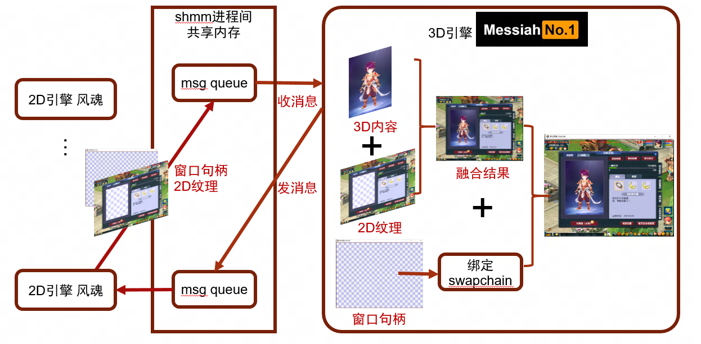

# 由于项目保密原因，不会出现内部编辑器、工具等图像，只有部分外放内容。

[TOC]

> 注意动态图像gif或者直接上传github的mp4比较大，直接web预览可能需要一些加载时间 。还请耐心等待。


一听到梦幻西游端游，可能会觉得是技术栈过早的项目，确实如此，作为20年前的2D游戏，采用CPU软光栅渲染的自研引擎（[云风](https://blog.codingnow.com/)开发的风魂引擎）, 确实已经落后时代了。

为了提升画面表现力（卖时装），我负责的模块Runtime采用独立的自研3D引擎（Messiah）硬生生塞到2D游戏引擎里面。



2、为了解决3D自研引擎编辑器不完善的问题，引擎组开发此前花了数年时间研发了**Unreal<->Messiah**对齐的一系列工具链，**美术，TA，策划乃至程序在开发中编辑器用都采用的Unreal4.26**，而放弃使用自研引擎Messiah的编辑器。

 

整个玩法是我经历了从**0-1**的过程

职责上：我负责了

* **搭建这套繁杂的跨引擎游戏制作管线**
* **工具链的完善，跨引擎的数据组织形式**

* **Runtime Gameplay的绝大部分开发任务（Messiah脚本代码从0开始写的）**

而引擎组的同学主要负责对齐引擎的渲染效果，资产转换等。


整体渲染还原二次元偏厚涂的风格立绘画风。上图是立绘效果，下图是Messiah引擎Runtime渲染效果


<center class="half">
     
</center>


如果对角色渲染比较感兴趣，可以看这一个文档，不过这块主要是TA的工作内容：[角色渲染.md](角色渲染.md )


## 1.Unreal对齐Messiah

Aurora：Unreal和Messiah一系列对齐的技术链，首先来看下实机效果

**以下视频均为UE&Messiah双引擎同时打开 + 实机录制的同步镜头视频**


这个是UE、Messiah通过RPC，双开两个引擎实时同步，对齐Camera等


## 2.Gamplay

### 2.0 脚本代码框架

#### 2.0.1 异步逻辑协程

Gameplay中存在诸多异步逻辑，比如加载资源等IO，动态贴图合并TextureAtlas，等待正确的渲染结果等。为了避免陷入回调地狱，一句话概括，抛弃所有的回调，改用协程。

#### 2.0.2 逻辑Plugin化

部分Messiah项目可能通用的代码，编辑器代码Runtime不需要的，或者内部调试的代码等统一解耦作为Plugin，减轻核心Gameplay代码复杂度。比如

* 角色动画编辑器, 剧情编辑器Montage等Editor部分
* hot reload，断点，GM指令，hunter等网易内部SDK
* ImGui的内部调试UI等图形化辅助开发部分

#### 2.0.3 SubSystem

Messiah借鉴UE的设计理念，在原有五类之外扩展一个ViewSubsystem生命周期类。


由于游戏特性，玩家经常本地开5个游戏客户端，然后游戏中UI也有小型的3D场景（红框内的），大的场景以及角色和UI小窗口的被称作**ShowRoom**的都归属于一个View。

比如管理小窗口相机等的GameViewportSubsystem, 管理玩家输入的InputSubsystem（点击小窗或者大场景角色交互，或者IK玩法操控Pose等），用于截图的ScreenshotShotSubsystem等（低配ShowRoom有优化，场景不是真的场景，就是2D图像）

除此之外，其余的大量之前用"Manager"的Gameplay层级逻辑都根据不同生命周期重构为Subsystem。

#### 2.0.4 网络同步模块

用伪代码描述

Entity、Component、Extension架构之上 C/S同一份代码，用装饰器修饰rpc方法。用类似宏去区分调用限制，参数类型等。

```python
@rpc_method(ATHENA_ONLY, CustomType(PropOperate))
def xxxxx(self, operate: PropOperate):
    pass
```

利用python协程支持有返回值的rpc

```python
async def __call__(self, *args, **kwargs):
    event = asyncio.Event()
    # gen unique rpc id
    # serialize(args) 
    # rpc
    await event.wait()
    return event.result
```

支持用meta描述的属性同步

```python
AvatarProp = {
	"m_name": PField(P_STR, default="jxk"),  # 名字
	"m_char_id": PField(P_INT)  # 角色id
}
```

#### 2.0.5 渲染参数部分

在不同的场景，获取显卡信息之后，根据设备等级分级预先设置各个渲染参数。Runtime修改使用上下文管理器对操作记录，并进行适当的操作限制、内容过滤和阻拦。

### 2.1 动画系统

#### 2.1.0 Unreal制作简易的动画蓝图，Messiah中实现完整的Graph(类似动画蓝图)

#### 2.1.1 ik的应用，其中还有输出OpenPose数据生成AI图像的玩法（专利）


https://github.com/user-attachments/assets/0a64261e-dc78-4378-aaec-a1401b09f6fa


#### 2.1.2 Messiah骨骼拼接技术，挂接物动画同步

#### 2.1.3 软骨以及布料


### 2.2 换装

首先请看简短的演示


https://github.com/user-attachments/assets/4c67dbc9-e85d-4945-aae4-50b62a6d0e19


类似叠纸的奇迹暖暖的换装


### 2.3 妆容


https://github.com/user-attachments/assets/f0781c08-47ce-4814-85bc-7182229a6223


### 2.4 染色


独特的染色Gameplay（用染色shader对贴图染色而非给shader传参数）)

玩法中还有如图的染色部位高光表现和UI对应的染色。

UI需要染色对应的图标


简化后的UI的染色shader大致的实现可以在shadertoy上进行预览

https://www.shadertoy.com/view/lX2XzV


### 2.5 场景以及LOD

## 3.Unreal开发

### 3.1 面向美术扩展编辑器

#### 3.1.1 染色编辑器等

#### 3.1.2 自动化美术资产工具链

首先由TA同学负责开发DDC(比如3ds max)->UE的插件


在得到美术通过TA插件导入UE的这些基础的材质球和贴图和SkeletalMesh之后，然后程序化创建各种资产并组装为某套时装的所有角色Actor蓝图，并完成减面等生成LOD资源过程。

参考下面视频中的工具：

https://github.com/user-attachments/assets/68e93eca-079f-4f1e-92b9-9a967ac82e07


#### 3.1.3 Sequencer

剧情（Cinematic）编辑在本项目的工作流程中是一个业务难点。

说到过美术是采用**Unreal**作为编辑器，那自然和其他的普通的UE项目是一样的，采用Sequencer编辑LevelSequence，需要把uasset转换为自研引擎**Messiah**能够识别的格式。

单独开发了插件去做数据转换，依托网易自研引擎无关的剧情系统Montage。

每套时装美术都会出一个CG宣传PV，有一些会变成Runtime的过场动画资产


比如如下视频:

CG:【爱如龙卷风，超唯美新春外观甜蜜来袭】 https://www.bilibili.com/video/BV1n5411C7Wi


Runtime:

https://github.com/user-attachments/assets/49e2b03e-7dc7-4e91-b3bc-8d6dbbf8f35d


### 3.2 面向策划工具

#### 3.2.1 蓝图转换为自研引擎可读工具链

比如利用3.1.2最后生成的Actor蓝图，策划会编辑Tag，然后序列化为自研引擎的资源。

## 4.Messiah自研引擎开发

主要是扩展Graph（类似动画蓝图）的编辑器，Runtime属性反射等功能的编辑器等

比如在剧情编辑器中，纯脚本实现动画混合功能，支持全局动态动作速率以及动画轨道section的速率。利用积分和动态规划预计算，对美术编辑的blend曲线缓存。


## 5.自动化

### 5.1 QA自动化测试

每周版本日，通过高度可配置的测试用例，让QA可以自动化回归外放的内容并生成图像文件，通过AI对比Diff，保证外放效果没有收到影响。

比如下图是支持可配置的角色以及挂接物的动画都固定某一帧(材质特效软骨物理等均暂停)


每周全量自动跑测试用例，与QA人肉确认过的标准数据集对比，如果有对比不通过的列举出来。


### 5.2 自动化构建

美术上传资源，策划修改配置，程序修改代码之后，到最后能够让QA跑起来的过程都是自动化构建部署在**TeamCity**上的，包括引擎Build，编译Shader，RefreshShaderGraph，资源代码Cook，合并分支，markdown构建网页等众多流程

#### 5.2.1 内部wiki站点

部署在win server上，用[`NSSM`](https://nssm.cc/)包装两个服务，一个Auth服务用于鉴权，一个nginx服务负责做壳和端口分发。实际是mkdocs，使用的主题是 [`mkdocs-material`](https://squidfunk.github.io/mkdocs-material/) 。支持**中文搜索**，**视频**，**公式**等

