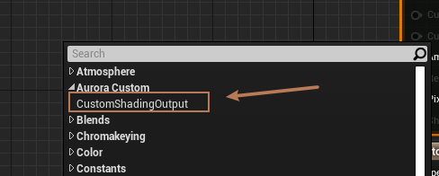

自定义ShadingModel是高阶需求，由图程或TA来编写物体的光照渲染逻辑，而不是使用UE4给的几个ShadingModel。网上大部分教程都是需要修改引擎源码来完成


但是在Unreal编辑器Messiah Runtime这个环境下，（不改Unreal源码）

仍希望找到一种不用修改引擎源码的方式，[该链接](https://github.com/Eragon-Brisingr/ToonShader)刚好满足我们的需求。

具体的实现步骤和链接里面一样，不再赘述，已经集成到Unreal转Messiah插件，图程或TA直接修改shading相关的代码即可。下面讲一下一些注意的事项。

#### 1. 原理

它的原理很简单，在插件里面创建一个module，该module的启动时间为`EarliestPossible`，主要将我们修改的shader 直接override掉引擎的shader。接着利用UE4引擎会为派生自`CustomOutput`的类在shader里面定义`NUM_MATERIAL_OUTPUTS_*****`宏的特性（这里需要我们派生`CustomOutuput`写一个子类），在`BasePass shader` 写入`ShadingModelID`的时候 直接屏蔽掉引擎获取`shadingmodeID`的函数，而是写入自己的`shadingModelID`，如下代码所示：

```cpp
# if NUM_MATERIAL_OUTPUTS_GETCUSTOMSHADING
	uint ShadingModel = SHADINGMODELID_AURORA;
# else
	uint ShadingModel = GetMaterialShadingModel(PixelMaterialInputs);
# endif
```

#### 2. 使用方式

在材质编辑器里面，直接使用派生自CustomOutput的子类节点即可，这样就可以无视Master节点的ShadingModel的选项，而使用我们自定义的ShadingModel

