由于slate编写起来比较的痛苦，并且cpp的开发效率不是很高，梦幻西游端游UE编辑器中不少的工具都是用PyQt来实现的（网易的主流语言是python。。。），包括如下的这个染色编辑器

入口：

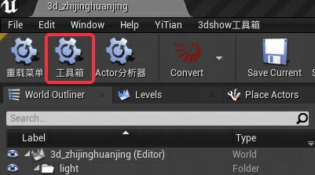

读取DataTable数据这些略过不提，可以看到每个贴图文件都是成对出现的，这个主要是为了支持染色的功能

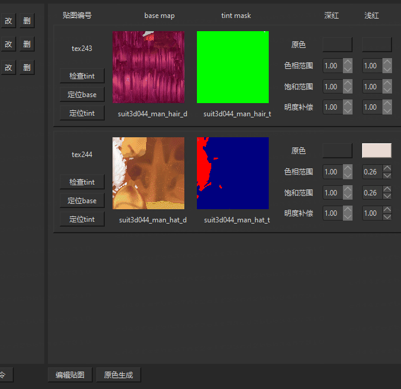

每个基础的装备都有很多可以染色部位，每个区域的划分就是由动图右侧的_t结尾的贴图决定的，可以看到有不同的颜色区块，在编辑器中是这样的

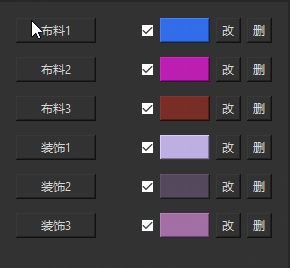

游戏Runtime的UI如下

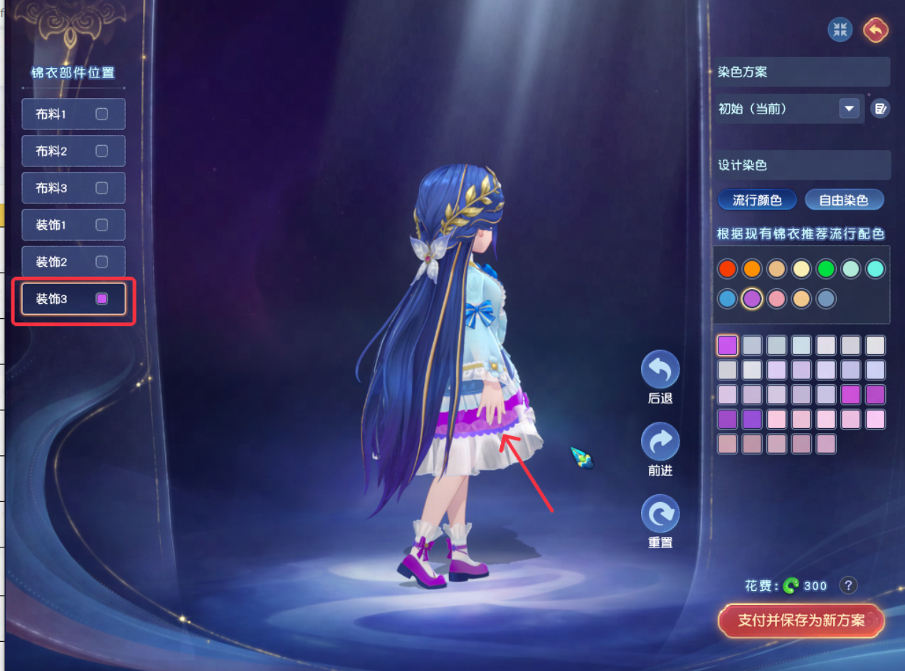

每个贴图都包含一个原贴图（\_d）和染色通道贴图（\_t），其中染色通道贴图包含了6个染色通道，分别为深红（r1）、浅红（r2）、深绿（g1）、浅绿（g2）、深蓝（b1）、浅蓝（b2），这些通道对原贴图进行了划分，可以独立进行染色。

例如这一对贴图，染色通道贴图中包含了四种颜色（r2、g1、g2、b2）：

因此它将原贴图分为了四个部分进行独立染色

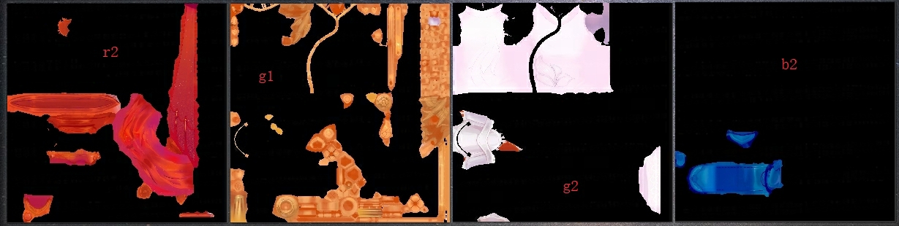

假设某个equip存在m个分块，n个贴图，那么能分出的通道数最多为6n，相当于用m个分块控制最多6n的通道，其中存在一对多的对应关系。

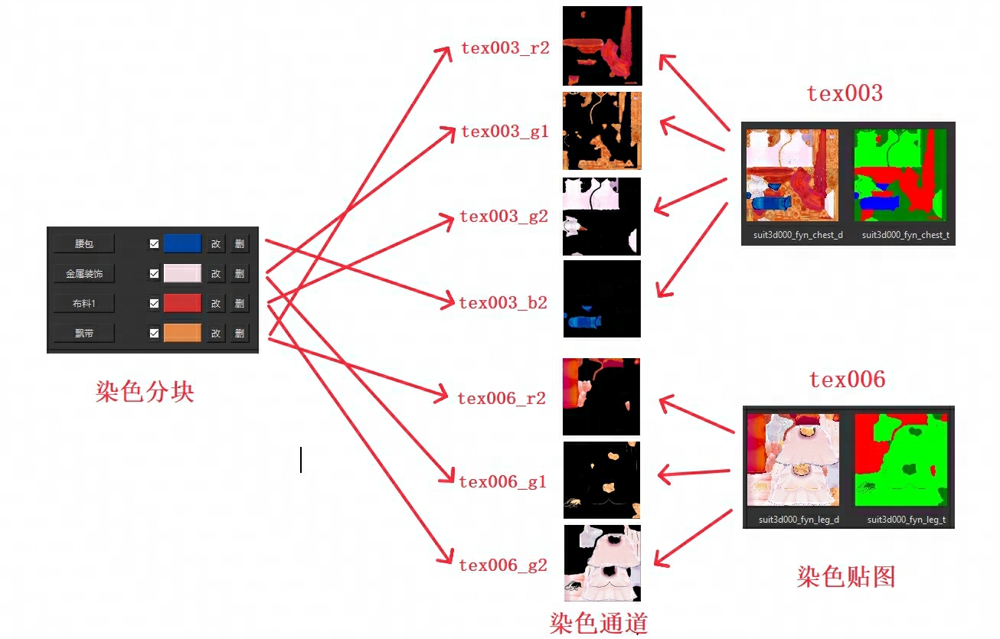

编辑器中点击分块名可以预览这种对应关系：

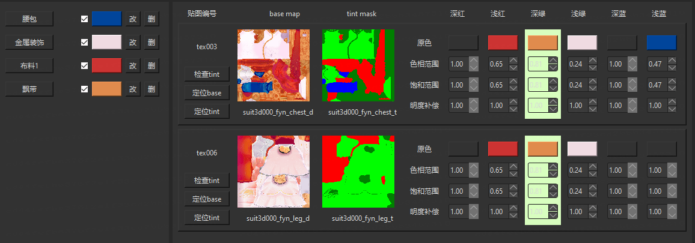

### 原色生成

对于某一个通道，首先需要指定一下原色，也就是从原贴图中吸取一个能代表此分块的平均色

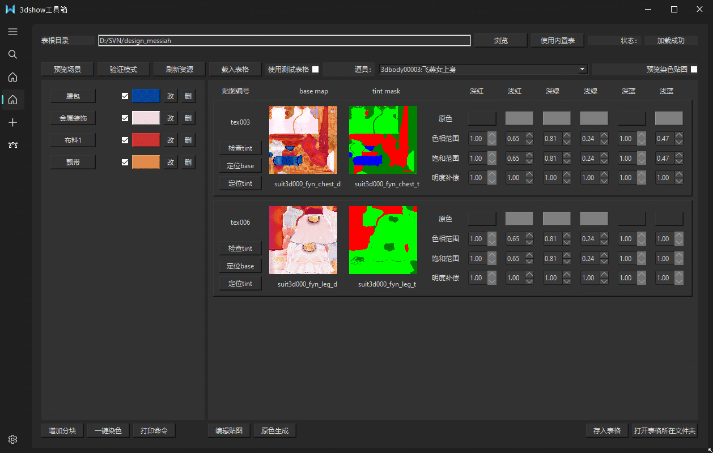

如果觉得逐个吸取原色比较麻烦，可以点击原色生成，自动计算每个染色分块所对应的所有染色分块的平均色：

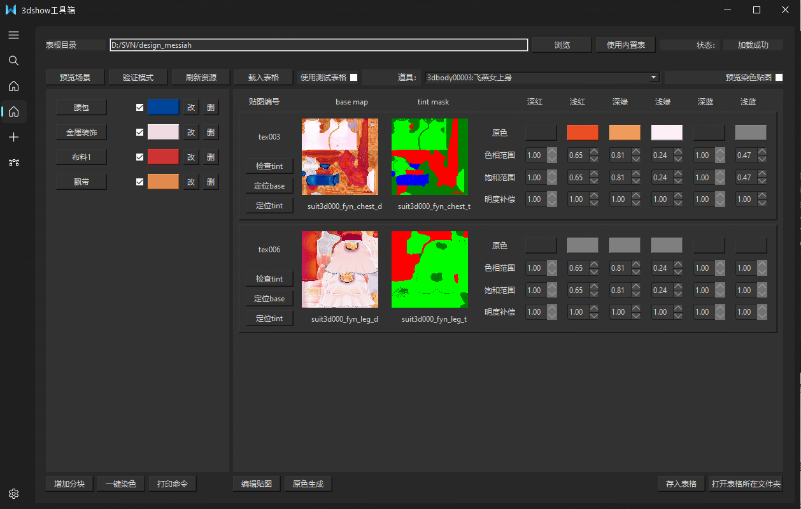

### 预览染色

可以在场景中预览染色

### 一键染色

如果想要快速配置染色，可以点击一键染色按钮打开一键染色窗口

可以打乱或生成随机颜色：

可以载入一张图片，通过AI提取主色，应用到染色上：

### 染色微调

#### 颜色溢出

由于原贴图上存在图案与纹理，原贴图上颜色的色相、饱和度、明度存在一定的变化范围。染色算法的原理就是将原贴图的色相、饱和度、明度相对于**原色**的变化同步迁移到**目标色**上。而当原色比较接近黑白灰等低饱和度颜色时，迁移后的颜色极容易出现色相/饱和度溢出：

为此，可以将对应通道的色相范围/饱和范围调小：

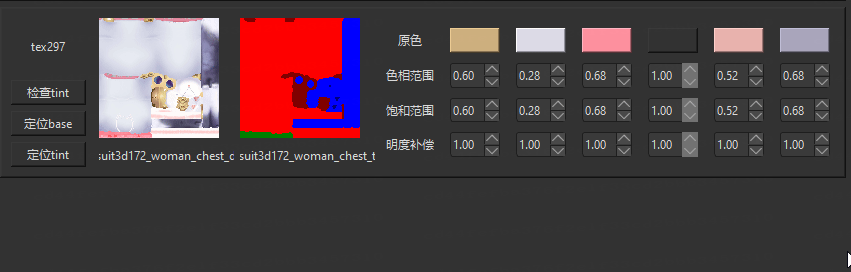

此时染色结果将不容易出现溢出：

#### 明度调整

如果觉得染色结果比预想的过亮或过暗，可以调整明度补偿：

### 保存结果

调整完染色效果后，可以自动存入表格，并提交表格：

#### PS. 贴图规范检查器

针对美术提交的_d贴图有对应的自动检查规范工具

如果在某个_t贴图中有一些错误的颜色，点击该帖图的检查tint按钮，可以看到杂色的部分在不断闪烁，下方问题提示存在杂色以及杂色的比例，另外提示b1，也就是深蓝通道缺失：

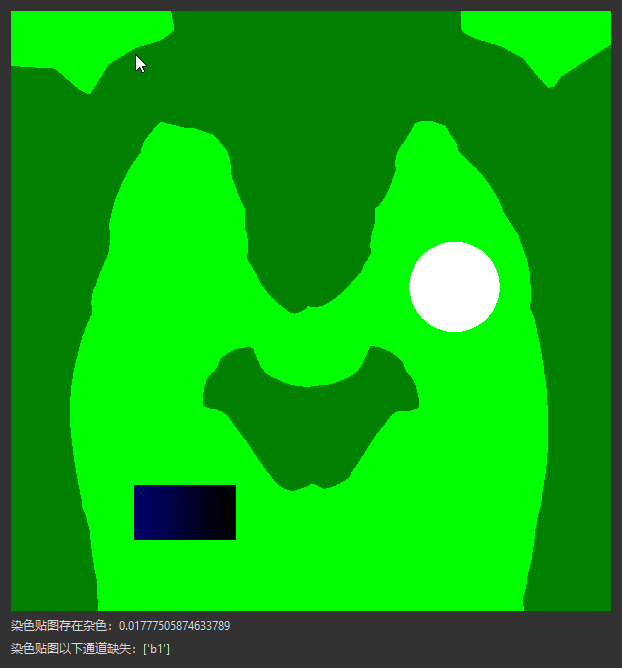