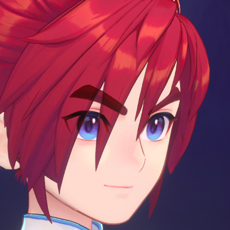

角色渲染分为三个部分：

* 脸部
  * 体感过渡
  * 头发双层次高光
  * 边缘光细节
  * 脸上柔和过度的光
  * 较多眼睛细节
  * 鼻唇高光点
* 服装
  * 金属上特殊形状的高光
  * 亮暗部冷暖颜色丰富
  * 带色彩的描边
  * 边缘光

## 1、头部

### 1.1、风格化光影

#### 1.1.1 脸部高光

* 两套SDF贴图记录制定化光影

* 处于背光和侧面光时两张额外遮罩图对特殊角度光影进行补充
* 再基于旋转角度混合不同阶段的SDF图

#### 1.1.2 头发高光

用View空间下视角向量
与View空间下的光照方向做点积，
计算光对高光位置的影响

还与View空间下的角色面朝前向量做点积
计算角色旋转时对高光位置的影响

并将上面的结果与UV相加，在Y方向偏移贴图位置

#### 1.1.3 鼻尖/嘴唇手绘高光

用view空间下视角向量与（-1，0，0）做点积，
得出的值用来偏移UV

头往右转，uv偏移与越来越大的正数相加，
头往左转，uv偏移与越来越小的负数相加

### 1.2、眼睛眉毛透过刘海渲染

UE中没有多pass，眉毛眼睛透过刘海不好实现

为UE引擎开发了**Shell**功能，支持开启Stencil蒙板，并且对齐Messiah

* 利用shell功能单独对眼眉进行标记
* 头发材质中读取标记区域(上图中白色）作为遮罩
* 遮罩内区域将通过SceneColor获取到的被标记的眼眉颜色与头发本色进行混合

### 1.3 脸部刘海阴影

支持调整

- 阴影位置（光照角度）
- 阴影颜色
- 阴影的强度
- 阴影的软硬边缘
- 阴影的偏移Bias值

#### 1.3.1 UE编辑面板

- 除可编辑区域的参数需要调整，其他都自动生成（仅作校验用）

#### 1.3.2 实现原理

生成头发深度图-------> 绘制角色的脸，比较头发与脸的深度值

**生成头发深度图**

- 拍摄头发的深度图
- 计算世界空间->灯光空间的变换矩阵
- 将用户设置的参数传递给脸部材质，用于渲染

**比较头发与脸的深度值**

- 核心过程：将脸部位置的点转换到灯光空间（以相机位置为原点，相机（影子灯）朝向为Z轴的坐标空间），得到该空间下脸部位置的深度值position.z。采样深度贴图中头发的深度值depth，两者比较。若position.z > depth说明这个位置的脸部处于阴影中。
- 结合了改良的esm算法处理软硬阴影的边缘过渡。
- 为了跟Messiah的深度数据匹配，调整了UE的深度值范围：2倍OrthoWidth范围内的深度值转换到[0,1]之间。（Messiah的视锥体深度就是2倍OrthoWidth范围）****

### 1.4 眼睛

眼睛是Gameplay的一种玩法，可以自由的更换

因此使用面片层叠的方式而没有做视差，方便对眼睛细节做调整

## 2 身体

### 2.1 手绘风格毛材质

-SD-> SP -> UE材质流程

程序化纹理 

按照需求定制毛**细节固有色贴图** + **细节法线贴图**

法线细节纹理

做兰伯特计算分别获得受光面,明暗交界线,背光面区域的mask
同时还能获得毛形状的光影边缘

**受光面**

80%
纯色/细节较少的固有色贴图

Lerp

20%
细节固有色纹理

**明暗交界线**

20%
纯色/细节较少的固有色贴图

Lerp

80%
细节固有色纹理

**背光面**

50%
纯色/细节较少的固有色贴图

50%
细节固有色纹理

### 2.2 绒毛材质

主要用在服装绒毛上

做了简化：没有毛AO和各向异性高光

### 2.3 风格化金属高光

### 2.4 风格化火

TODO： 可以是视频

### 2.5 琥珀/宝石类材质

宝石内部杂质+视差
模拟光线透过宝石折射后聚焦在底部
宝石内部有亮片闪烁

### 2.6 钻石材质

<video src="角色渲染.assets/media17.mp4"></video>

### 2.7 边缘光效果细节

