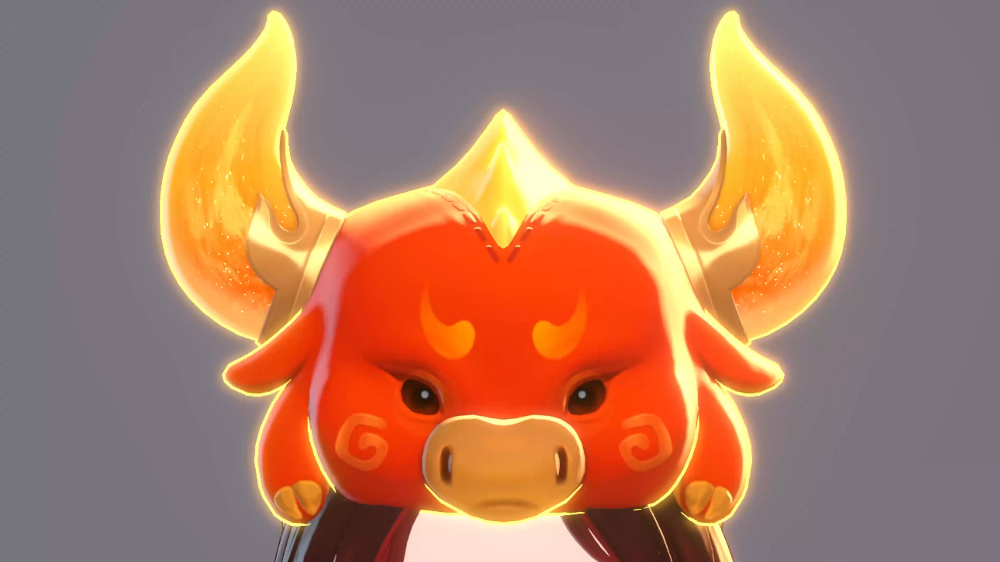

角色渲染分为三个部分：

* 脸部
  * 体感过渡
  * 头发双层次高光
  * 边缘光细节
  * 脸上柔和过度的光
  * 较多眼睛细节
  * 鼻唇高光点
* 服装
  * 金属上特殊形状的高光
  * 亮暗部冷暖颜色丰富
  * 带色彩的描边
  * 边缘光

## 1、头部

### 1.1、风格化光影

#### 1.1.1 脸部高光

#### 1.1.2 头发高光

#### 1.1.3 鼻尖/嘴唇手绘高光

### 1.2、眼睛眉毛透过刘海渲染

UE中没有多pass，眉毛眼睛透过刘海不好实现

为UE引擎开发了**Shell**功能，支持开启Stencil蒙板，并且对齐Messiah

### 1.3 脸部刘海阴影

### 1.4 眼睛

眼睛是Gameplay的一种玩法，可以自由的更换

因此使用面片层叠的方式而没有做视差，方便对眼睛细节做调整

## 2 身体

### 2.1 手绘风格毛材质

### 2.2 绒毛材质

主要用在服装绒毛上

### 2.3 风格化金属高光

### 2.4 风格化火

### 2.5 琥珀/宝石类材质

宝石内部杂质+视差
模拟光线透过宝石折射后聚焦在底部
宝石内部有亮片闪烁

### 2.6 钻石材质

### 

目前已经有30套风格迥异的服装，这里只列举了凤毛麟角的材质，TA在材质实现这方面是比较复杂的，主要是得益于上文提到的**ShellComponent**的实现。